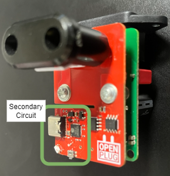

# openPLUG

This repository contains the files for ongoing development of the openPLUG.

- [Schematic prints](./PCB%20design/Schematic%20Prints.PDF)
- [Assembly drawings](./PCB%20design/Assembly%20Drawings_pic.PDF)

## 사용 방법

### 전기 안전에 관한 주의 사항

> :warning: **감전 위험** 반드시 아래 사항을 확인하여 주십시오.

- `정격 전원`: 110-240 VAC, 50/60 Hz, Max. 16 A
- `위험한 영역`: 별도의 케이싱이 없는 개발 키트로써, PCB의 대부분의 영역이 감전의 위험이 있는 1차 측입니다. 케이블을 제거하거나 연결할 때 반드시 절연 장갑을 착용하시기 바랍니다.
- `안전한 영역`: 아래 사진에 표시한 영역은 2차측으로 전기적 절연되어 있는 영역이므로, 맨손으로 만지거나 외부 장치와 안전하게 연결할 수 있습니다. 그 외의 영역은 맨손으로 만졌을 때 감전의 위험이 있습니다.

</img>

### 전원 공급

전원을 공급하기 위한 2가지 방법이 있습니다.

1. AC 메인으로 전원 공급

2. USB 케이블로 전원 공급
